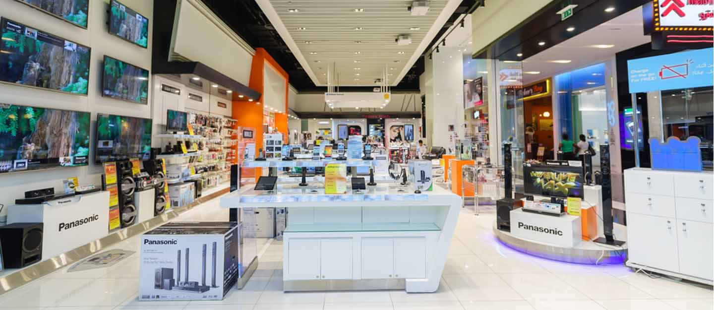
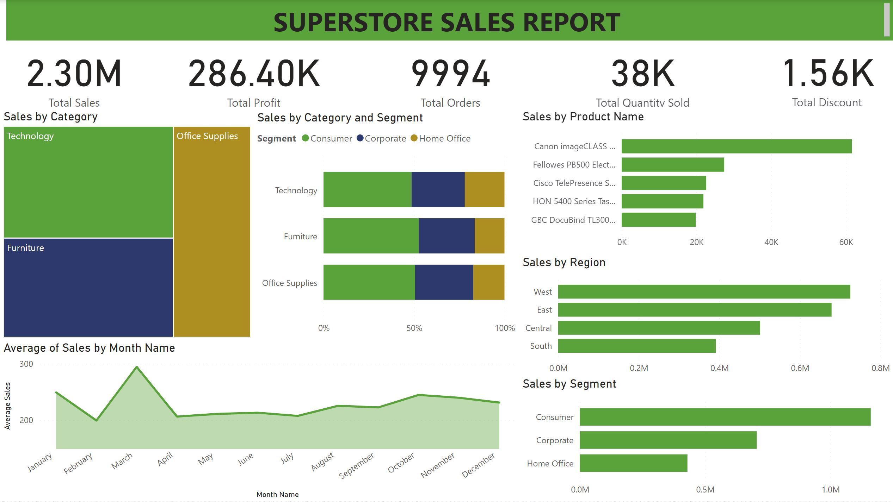
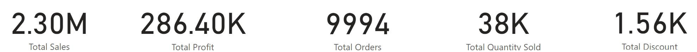
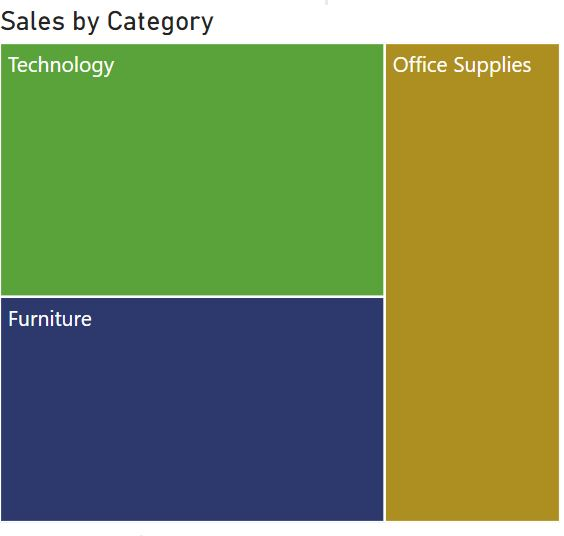
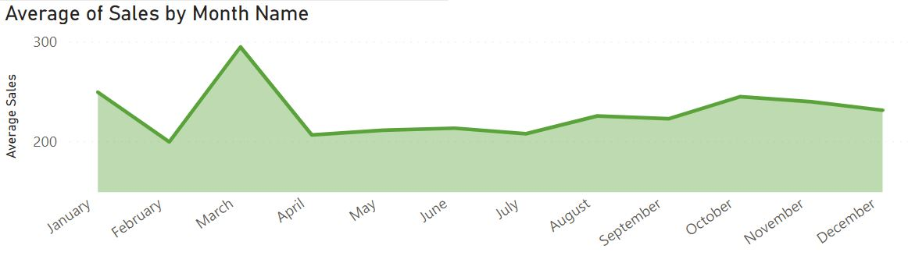
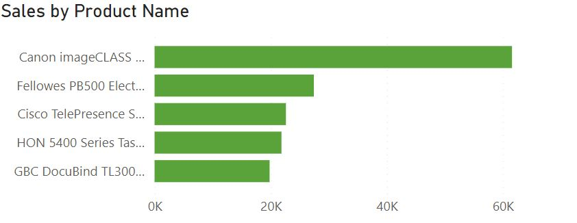

# Superstore-Exploratory-Analysis-Using-Power-BI
A Microsoft Power BI project on the sales analysis of the Superstore organization in the last 3 years

## Introduction
This is a Microsoft Power BI project on sales analysis of an imaginary store called Superstore from January 3rd, 2014 to April 15, 2017. The project is to analyze and derive insights to answer business questions, which will lead to the store making data-driven decisions. **_Disclaimer**: **_All datasets and reports do not represent any company, institution, or country. This is a dummy dataset to demonstrate the capabilities of Microsoft Power BI._**

Below is a dashboard for all visualizations

## Skills / Concepts Demonstrated
The following Microsoft Power BI skills were incorporated: importation and cleaning, exploratory analysis, data manipulation, and visualization.
Problem Statement
Superstore’s mission is to provide high-quality products (technological products, office supplies, and furniture) to organizations and the general public alike. This data covers its sales over 3 years. They want to identify the various performance indexes of the organization to know where they stand and if they are heading towards their goal of profitability with assortment. These indexes include:
•	Total number of orders, Sales, and profit for the 3-year period
•	Sales concerning category and region
•	The difference in revenue over time for each month
•	Top products sold over the 3-year period
•	Recommendations to increase sales

## Data Cleaning
The dataset contains 9994 rows and 21 columns before cleaning and validation. I have validated all the columns against the criteria in the dataset table:
-	No missing values in any row
-	City, Country, and State columns have their data types converted to location types.
-	Three new columns are created for time series analysis (Year, Month Name and Month Number)

After the data validation, the dataset contains 9994 rows and 23 columns without missing values.

# Exploratory Analysis
## Total number of orders, Sales, and profit for the 3-year period?
According to the dataset, over the 3 years, there has been a sales revenue of 2.3 million, a total profit of 286K, 9994 total orders, and 38K products sold. 2017 has the highest sales revenue and profit generated so far (733.22K and 93.44K respectively)

## Sales for category and region
The Western Region has the most sales in the last 3 years (725K). It’s followed by the Eastern (678K), Central (501K) and Southern (391K) regions respectively. The category with the most sales is Technology(836K), followed by Furniture(742K) and then Office Supplies(719K).

## Average Sales Per Month
March is the month that has recorded the most sales in the last 3 years. It seems the promotional material for Spring has been successful so far. Leaving room for improvements for months in Summer and especially Winter.

Top 5 products over the 3 years
The product with the highest sales is the Canon Image CLASS 2200 Advanced copier which makes up 13% of all sales in the technology category. The PB500 Electric binding machine follows with 3.8% of office supplies sales. The Cisco Telepresence video-conferencing Unit follows with 2.7% of tech sales. The HON 5400 Series Task chairs make up 3% of furniture sales (the only product in the top 5) and finally the GBC Electric Binding System makes up 2.75% of office supplies.

## Recommendations
-	A deep dive into the Southern region to investigate why it’s the region with the lowest sales.
-	A lot more emphasis should be placed on end-of-year campaigns to improve sales during winter which has the highest potential of growth.
-	Introduction of promotional material for the Home Office segment to improve sales.

